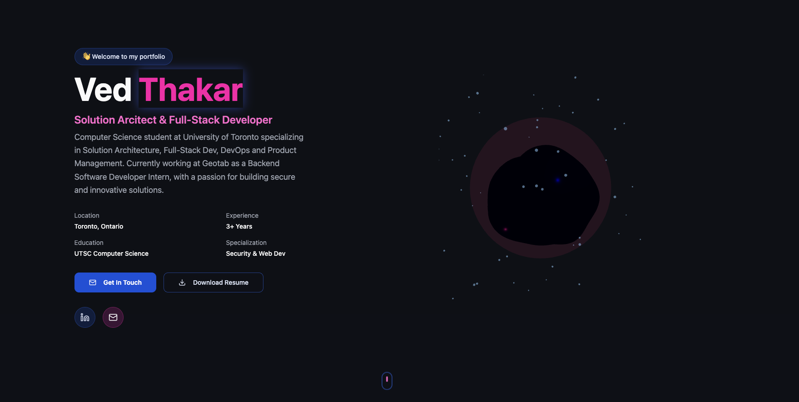
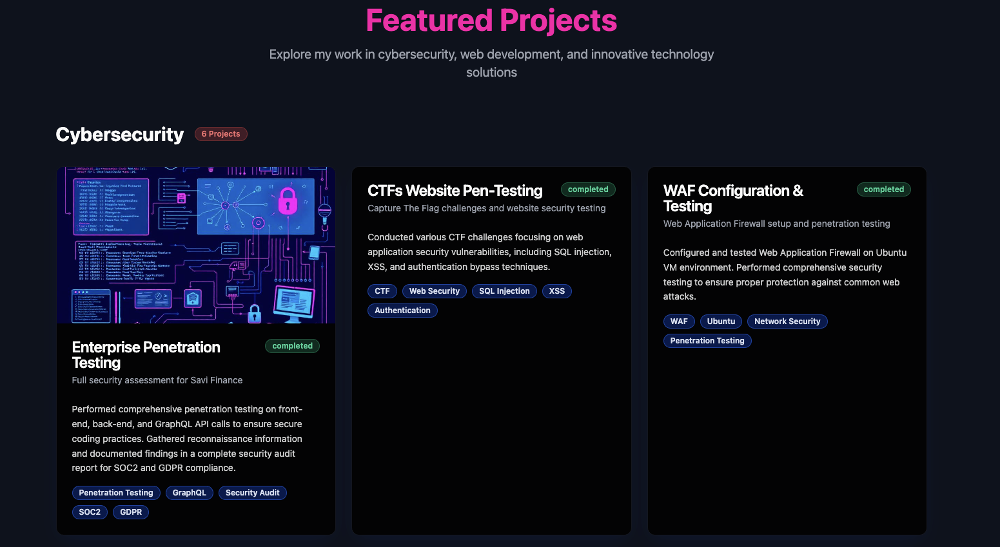
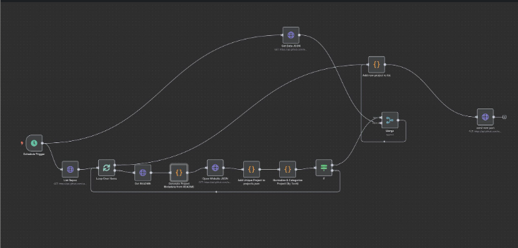

# Personal Website + Automated Project Sync

This is my personal portfolio website, built to showcase my projects, experience, and the kind of systems I like building.

What makes this project different from a typical personal website is that it is not just a static portfolio. I built an **n8n automation workflow** around it so my site can stay updated with new projects automatically, without me having to manually edit the codebase every time I ship something new.

A lot of people have personal websites, but keeping them updated is annoying. Every new project usually means opening the portfolio repo, editing the projects section, committing changes, and pushing again just to add one more entry. That process felt repetitive and broken, so I turned it into a system.

---

## Live Site

**Portfolio URL:** `https://vedthakar.github.io/`

---

## What this project is

This project is my personal website and portfolio, designed to highlight my work in software development, automation, systems thinking, and technical project building.

It serves two purposes:

1. **Portfolio website**  
   A clean front-end that displays my projects, background, and technical interests.

2. **Automation-driven project updater**  
   An n8n workflow that detects new GitHub repositories, extracts relevant project information, categorizes it, and writes it into a structured JSON file that the website reads from.

Instead of treating the portfolio as a static page, I wanted to treat it more like a small platform with its own data flow.

---

## Why I built this

I got tired of manually updating my portfolio every time I built something new.

Before this system, every update looked like this:
- Open the portfolio repo
- Edit the projects list manually
- Add project title, description, links, tags, and category
- Commit and push changes
- Repeat again the next time I ship something

That may seem small, but over time it adds friction. For something as important as a portfolio, I wanted updates to happen automatically and reliably.

So I built an automation that keeps my website in sync with my GitHub projects.

---

## How the automation works

The n8n workflow powers the project-sync system behind this website.

### Workflow overview

- Runs on a schedule
- Connects to the GitHub API
- Detects repositories that should be added to the portfolio
- Scrapes or reads each repository's README / metadata
- Extracts useful project information
- Applies custom categorization logic
- Writes the final structured data into a central `projects.json` file
- The website reads from that JSON file and updates automatically

This means I do not need to manually update the project list every time I create or improve something.

### Key automation features

#### Auto-detect new projects
The workflow checks GitHub for new repositories and identifies which ones should appear on the portfolio.

#### README-powered project extraction
Instead of manually rewriting project summaries, the automation pulls useful details from each repo's README and metadata.

#### Smart categories
Projects can be grouped into categories like:
- Cyber Security
- Web Development
- Innovation
- Automation
- DevOps

The categorization logic is customizable, so someone else using this workflow could swap in their own sections like:
- Data Science
- Mobile Development
- Research
- AI / ML
- Cloud Infrastructure

#### Reusable by other developers
I built this so it is not just a one-off workflow for me. The system is modular and can be adapted by other people who have GitHub-based portfolio sites, especially if their site reads from JSON.

---

## Tech stack

This project is built with:

- **React**
- **TypeScript**
- **Vite**
- **Tailwind CSS**
- **shadcn/ui**
- **n8n**
- **GitHub API**
- **JSON-based project data pipeline**

### Frontend
The website itself is built using React and TypeScript with Vite for fast development and Tailwind CSS + shadcn/ui for styling and UI components.

### Automation / backend workflow
The automation layer is built in n8n and uses API-driven logic to fetch project data, transform it, and push it into the portfolio data source.

---

## Running this project locally

To run the website on your device:

```sh
# Clone the repository
git clone <YOUR_GIT_URL>

# Go into the project folder
cd <YOUR_PROJECT_NAME>

# Install dependencies
npm install

# Start the local development server
npm run dev





